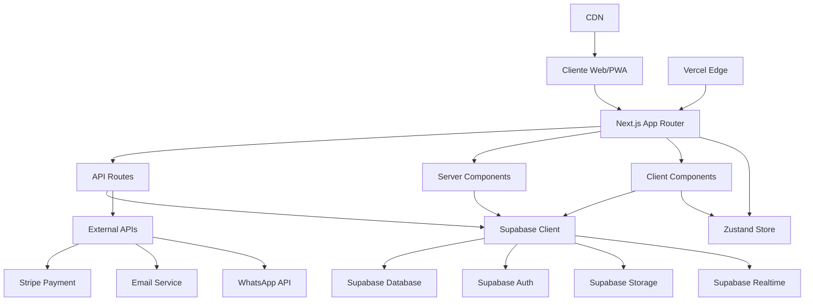

# JC Pastelaria Gourmet - Documento de Design

## Visão Geral

O sistema JC Pastelaria Gourmet é uma aplicação web moderna construída com Next.js 14, TypeScript, Supabase e Tailwind CSS. A arquitetura segue princípios de Clean Architecture, com separação clara de responsabilidades e foco em escalabilidade, manutenibilidade e performance.

## Arquitetura do Sistema

### Arquitetura Geral



### Stack Tecnológico

#### Frontend
- **Next.js 14**: Framework React com App Router para SSR/SSG
- **TypeScript**: Tipagem estática para maior confiabilidade
- **Tailwind CSS**: Framework CSS utilitário para estilização
- **Framer Motion**: Biblioteca de animações performáticas
- **Zustand**: Gerenciamento de estado leve e eficiente
- **React Query**: Cache e sincronização de dados do servidor
- **React Hook Form**: Gerenciamento de formulários otimizado

#### Backend
- **Supabase**: Backend-as-a-Service para auth, database e storage
- **PostgreSQL**: Banco de dados relacional robusto
- **Row Level Security**: Segurança a nível de linha no banco
- **Supabase Realtime**: WebSockets para atualizações em tempo real

#### Infraestrutura
- **Vercel**: Plataforma de deploy com Edge Functions
- **Vercel Analytics**: Monitoramento de performance
- **Stripe**: Gateway de pagamento seguro
- **Resend**: Serviço de email transacional

### Padrões Arquiteturais

#### 1. Clean Architecture
```
src/
├── app/                    # Next.js App Router (Presentation Layer)
├── components/             # UI Components (Presentation Layer)
├── lib/                   # External Interfaces (Infrastructure Layer)
├── hooks/                 # Custom Hooks (Application Layer)
├── store/                 # State Management (Application Layer)
├── utils/                 # Utilities (Infrastructure Layer)
└── types/                 # Type Definitions (Domain Layer)
```

#### 2. Component Architecture
- **Atomic Design**: Atoms → Molecules → Organisms → Templates → Pages
- **Compound Components**: Para componentes complexos reutilizáveis
- **Render Props**: Para lógica compartilhada entre componentes
- **Custom Hooks**: Para lógica de negócio reutilizável

#### 3. State Management
- **Zustand**: Estado global para auth, cart, theme
- **React Query**: Cache de dados do servidor
- **Local State**: useState/useReducer para estado local
- **URL State**: Para filtros e navegação

## Componentes e Interfaces

### Estrutura de Componentes

#### 1. Layout Components
```typescript
// Layout principal da aplicação
interface RootLayoutProps {
  children: React.ReactNode;
  params: { locale: string };
}

// Header com navegação e ações do usuário
interface HeaderProps {
  user?: User | null;
  cartItemsCount: number;
  onCartToggle: () => void;
  onAuthToggle: () => void;
}

// Footer com links e informações
interface FooterProps {
  companyInfo: CompanyInfo;
  socialLinks: SocialLink[];
}
```

#### 2. Product Components
```typescript
// Card de produto no catálogo
interface ProductCardProps {
  product: Product;
  onAddToCart: (product: Product, options: ProductOptions) => void;
  onQuickView: (product: Product) => void;
  isLoading?: boolean;
}

// Modal de detalhes do produto
interface ProductModalProps {
  product: Product;
  isOpen: boolean;
  onClose: () => void;
  onAddToCart: (product: Product, options: ProductOptions) => void;
}

// Customizador de produto
interface ProductCustomizerProps {
  product: Product;
  selectedOptions: ProductOptions;
  onOptionsChange: (options: ProductOptions) => void;
  onPriceCalculate: (price: number) => void;
}
```

#### 3. Cart Components
```typescript
// Carrinho lateral (drawer)
interface CartDrawerProps {
  isOpen: boolean;
  onClose: () => void;
  items: CartItem[];
  onUpdateQuantity: (itemId: string, quantity: number) => void;
  onRemoveItem: (itemId: string) => void;
  onCheckout: () => void;
}

// Item do carrinho
interface CartItemProps {
  item: CartItem;
  onUpdateQuantity: (quantity: number) => void;
  onRemove: () => void;
  isEditable?: boolean;
}
```

#### 4. Gamification Components
```typescript
// Exibição de pontos do usuário
interface PointsDisplayProps {
  points: number;
  level: UserLevel;
  nextLevelPoints: number;
  animated?: boolean;
}

// Barra de progresso de nível
interface LevelProgressProps {
  currentPoints: number;
  levelRange: { min: number; max: number };
  showAnimation?: boolean;
}

// Card de conquista
interface AchievementCardProps {
  achievement: Achievement;
  isUnlocked: boolean;
  progress?: number;
  onClaim?: () => void;
}

// Desafio ativo
interface ChallengeCardProps {
  challenge: Challenge;
  userProgress: UserChallenge;
  onParticipate: () => void;
}
```

#### 5. Dashboard Components
```typescript
// Dashboard principal do usuário
interface UserDashboardProps {
  user: User;
  stats: UserStats;
  recentOrders: Order[];
  activeChallenges: Challenge[];
  achievements: UserAchievement[];
}

// Estatísticas do usuário
interface StatsCardProps {
  title: string;
  value: string | number;
  icon: React.ReactNode;
  trend?: 'up' | 'down' | 'neutral';
  trendValue?: string;
}
```

### Design System

#### 1. Tokens de Design
```typescript
// Cores (já implementadas no Tailwind)
const colors = {
  primary: {
    50: '#FFFBF0',
    500: '#FFC700', // Amarelo principal
    900: '#997700',
  },
  accent: {
    500: '#753700', // Laranja-escuro
  },
  // ... outras cores
};

// Tipografia
const typography = {
  fontFamily: {
    sans: ['Inter', 'system-ui'],
    display: ['Poppins', 'system-ui'],
  },
  fontSize: {
    xs: '0.75rem',
    sm: '0.875rem',
    base: '1rem',
    lg: '1.125rem',
    xl: '1.25rem',
    '2xl': '1.5rem',
    '3xl': '1.875rem',
    '4xl': '2.25rem',
  },
};

// Espaçamento
const spacing = {
  xs: '0.5rem',
  sm: '1rem',
  md: '1.5rem',
  lg: '2rem',
  xl: '3rem',
  '2xl': '4rem',
};
```

#### 2. Componentes Base
```typescript
// Botão base com variantes
interface ButtonProps {
  variant: 'primary' | 'secondary' | 'outline' | 'ghost';
  size: 'sm' | 'md' | 'lg';
  loading?: boolean;
  disabled?: boolean;
  children: React.ReactNode;
  onClick?: () => void;
}

// Input base
interface InputProps {
  label?: string;
  error?: string;
  helper?: string;
  required?: boolean;
  disabled?: boolean;
  type?: 'text' | 'email' | 'password' | 'tel';
}

// Modal base
interface ModalProps {
  isOpen: boolean;
  onClose: () => void;
  title?: string;
  size?: 'sm' | 'md' | 'lg' | 'xl';
  children: React.ReactNode;
}
```

## Modelos de Dados

### Esquema do Banco de Dados

#### 1. Tabelas Principais

```sql
-- Usuários
CREATE TABLE users (
  id UUID PRIMARY KEY DEFAULT gen_random_uuid(),
  email VARCHAR(255) UNIQUE NOT NULL,
  name VARCHAR(255) NOT NULL,
  phone VARCHAR(20),
  avatar_url TEXT,
  points INTEGER DEFAULT 0,
  level user_level DEFAULT 'bronze',
  total_spent DECIMAL(10,2) DEFAULT 0,
  orders_count INTEGER DEFAULT 0,
  preferences JSONB DEFAULT '{}',
  is_active BOOLEAN DEFAULT true,
  email_verified BOOLEAN DEFAULT false,
  phone_verified BOOLEAN DEFAULT false,
  created_at TIMESTAMP WITH TIME ZONE DEFAULT NOW(),
  updated_at TIMESTAMP WITH TIME ZONE DEFAULT NOW()
);

-- Categorias de produtos
CREATE TABLE categories (
  id UUID PRIMARY KEY DEFAULT gen_random_uuid(),
  name VARCHAR(255) NOT NULL,
  description TEXT,
  icon VARCHAR(100),
  color VARCHAR(7),
  order_index INTEGER DEFAULT 0,
  is_active BOOLEAN DEFAULT true,
  created_at TIMESTAMP WITH TIME ZONE DEFAULT NOW()
);

-- Produtos
CREATE TABLE products (
  id UUID PRIMARY KEY DEFAULT gen_random_uuid(),
  name VARCHAR(255) NOT NULL,
  description TEXT NOT NULL,
  price DECIMAL(10,2) NOT NULL,
  category_id UUID REFERENCES categories(id),
  image_url TEXT,
  images TEXT[] DEFAULT '{}',
  is_available BOOLEAN DEFAULT true,
  preparation_time INTEGER DEFAULT 30,
  rating DECIMAL(3,2) DEFAULT 0,
  reviews_count INTEGER DEFAULT 0,
  orders_count INTEGER DEFAULT 0,
  nutritional_info JSONB DEFAULT '{}',
  allergens TEXT[] DEFAULT '{}',
  created_at TIMESTAMP WITH TIME ZONE DEFAULT NOW(),
  updated_at TIMESTAMP WITH TIME ZONE DEFAULT NOW()
);

-- Tamanhos de produtos
CREATE TABLE product_sizes (
  id UUID PRIMARY KEY DEFAULT gen_random_uuid(),
  product_id UUID REFERENCES products(id) ON DELETE CASCADE,
  name VARCHAR(100) NOT NULL,
  price_modifier DECIMAL(10,2) DEFAULT 0,
  description TEXT,
  is_available BOOLEAN DEFAULT true
);

-- Customizações de produtos
CREATE TABLE product_customizations (
  id UUID PRIMARY KEY DEFAULT gen_random_uuid(),
  product_id UUID REFERENCES products(id) ON DELETE CASCADE,
  name VARCHAR(255) NOT NULL,
  type customization_type NOT NULL,
  required BOOLEAN DEFAULT false,
  max_selections INTEGER DEFAULT 1,
  order_index INTEGER DEFAULT 0
);

-- Opções de customização
CREATE TABLE customization_options (
  id UUID PRIMARY KEY DEFAULT gen_random_uuid(),
  customization_id UUID REFERENCES product_customizations(id) ON DELETE CASCADE,
  name VARCHAR(255) NOT NULL,
  price_modifier DECIMAL(10,2) DEFAULT 0,
  is_available BOOLEAN DEFAULT true,
  order_index INTEGER DEFAULT 0
);

-- Endereços dos usuários
CREATE TABLE addresses (
  id UUID PRIMARY KEY DEFAULT gen_random_uuid(),
  user_id UUID REFERENCES users(id) ON DELETE CASCADE,
  name VARCHAR(255) NOT NULL,
  street VARCHAR(255) NOT NULL,
  number VARCHAR(20) NOT NULL,
  complement VARCHAR(255),
  neighborhood VARCHAR(255) NOT NULL,
  city VARCHAR(255) NOT NULL,
  state VARCHAR(2) NOT NULL,
  zip_code VARCHAR(10) NOT NULL,
  is_default BOOLEAN DEFAULT false,
  created_at TIMESTAMP WITH TIME ZONE DEFAULT NOW()
);

-- Pedidos
CREATE TABLE orders (
  id UUID PRIMARY KEY DEFAULT gen_random_uuid(),
  user_id UUID REFERENCES users(id),
  subtotal DECIMAL(10,2) NOT NULL,
  delivery_fee DECIMAL(10,2) DEFAULT 0,
  discount DECIMAL(10,2) DEFAULT 0,
  total DECIMAL(10,2) NOT NULL,
  delivery_address_id UUID REFERENCES addresses(id),
  delivery_type delivery_type NOT NULL,
  estimated_delivery_time TIMESTAMP WITH TIME ZONE,
  status order_status DEFAULT 'pending',
  payment_status payment_status DEFAULT 'pending',
  payment_method VARCHAR(50) NOT NULL,
  payment_data JSONB DEFAULT '{}',
  notes TEXT,
  created_at TIMESTAMP WITH TIME ZONE DEFAULT NOW(),
  updated_at TIMESTAMP WITH TIME ZONE DEFAULT NOW(),
  delivered_at TIMESTAMP WITH TIME ZONE
);

-- Itens do pedido
CREATE TABLE order_items (
  id UUID PRIMARY KEY DEFAULT gen_random_uuid(),
  order_id UUID REFERENCES orders(id) ON DELETE CASCADE,
  product_id UUID REFERENCES products(id),
  quantity INTEGER NOT NULL,
  size_id UUID REFERENCES product_sizes(id),
  customizations JSONB DEFAULT '{}',
  notes TEXT,
  unit_price DECIMAL(10,2) NOT NULL,
  total_price DECIMAL(10,2) NOT NULL
);
```

#### 2. Tabelas de Gamificação

```sql
-- Conquistas
CREATE TABLE achievements (
  id UUID PRIMARY KEY DEFAULT gen_random_uuid(),
  name VARCHAR(255) NOT NULL,
  description TEXT NOT NULL,
  icon VARCHAR(100) NOT NULL,
  points_reward INTEGER NOT NULL,
  type achievement_type NOT NULL,
  requirements JSONB NOT NULL,
  is_active BOOLEAN DEFAULT true,
  created_at TIMESTAMP WITH TIME ZONE DEFAULT NOW()
);

-- Conquistas dos usuários
CREATE TABLE user_achievements (
  id UUID PRIMARY KEY DEFAULT gen_random_uuid(),
  user_id UUID REFERENCES users(id) ON DELETE CASCADE,
  achievement_id UUID REFERENCES achievements(id),
  earned_at TIMESTAMP WITH TIME ZONE DEFAULT NOW(),
  points_earned INTEGER NOT NULL,
  UNIQUE(user_id, achievement_id)
);

-- Desafios
CREATE TABLE challenges (
  id UUID PRIMARY KEY DEFAULT gen_random_uuid(),
  name VARCHAR(255) NOT NULL,
  description TEXT NOT NULL,
  icon VARCHAR(100) NOT NULL,
  points_reward INTEGER NOT NULL,
  type challenge_type NOT NULL,
  requirements JSONB NOT NULL,
  start_date TIMESTAMP WITH TIME ZONE NOT NULL,
  end_date TIMESTAMP WITH TIME ZONE NOT NULL,
  is_active BOOLEAN DEFAULT true,
  created_at TIMESTAMP WITH TIME ZONE DEFAULT NOW()
);

-- Participação dos usuários em desafios
CREATE TABLE user_challenges (
  id UUID PRIMARY KEY DEFAULT gen_random_uuid(),
  user_id UUID REFERENCES users(id) ON DELETE CASCADE,
  challenge_id UUID REFERENCES challenges(id),
  progress INTEGER DEFAULT 0,
  completed BOOLEAN DEFAULT false,
  completed_at TIMESTAMP WITH TIME ZONE,
  points_earned INTEGER DEFAULT 0,
  created_at TIMESTAMP WITH TIME ZONE DEFAULT NOW(),
  UNIQUE(user_id, challenge_id)
);

-- Cupons
CREATE TABLE coupons (
  id UUID PRIMARY KEY DEFAULT gen_random_uuid(),
  code VARCHAR(50) UNIQUE NOT NULL,
  name VARCHAR(255) NOT NULL,
  description TEXT,
  type coupon_type NOT NULL,
  value DECIMAL(10,2) NOT NULL,
  minimum_order DECIMAL(10,2) DEFAULT 0,
  maximum_discount DECIMAL(10,2),
  usage_limit INTEGER,
  usage_count INTEGER DEFAULT 0,
  user_limit INTEGER DEFAULT 1,
  valid_from TIMESTAMP WITH TIME ZONE NOT NULL,
  valid_until TIMESTAMP WITH TIME ZONE NOT NULL,
  is_active BOOLEAN DEFAULT true,
  applicable_products UUID[] DEFAULT '{}',
  applicable_categories UUID[] DEFAULT '{}',
  created_at TIMESTAMP WITH TIME ZONE DEFAULT NOW()
);

-- Cupons dos usuários
CREATE TABLE user_coupons (
  id UUID PRIMARY KEY DEFAULT gen_random_uuid(),
  user_id UUID REFERENCES users(id) ON DELETE CASCADE,
  coupon_id UUID REFERENCES coupons(id),
  used_count INTEGER DEFAULT 0,
  last_used_at TIMESTAMP WITH TIME ZONE,
  created_at TIMESTAMP WITH TIME ZONE DEFAULT NOW(),
  UNIQUE(user_id, coupon_id)
);

-- Histórico de pontos
CREATE TABLE points_history (
  id UUID PRIMARY KEY DEFAULT gen_random_uuid(),
  user_id UUID REFERENCES users(id) ON DELETE CASCADE,
  points INTEGER NOT NULL,
  type points_type NOT NULL,
  description TEXT NOT NULL,
  reference_id UUID,
  reference_type VARCHAR(50),
  expires_at TIMESTAMP WITH TIME ZONE,
  created_at TIMESTAMP WITH TIME ZONE DEFAULT NOW()
);
```

#### 3. Tabelas de Suporte

```sql
-- Avaliações
CREATE TABLE reviews (
  id UUID PRIMARY KEY DEFAULT gen_random_uuid(),
  user_id UUID REFERENCES users(id),
  product_id UUID REFERENCES products(id),
  order_id UUID REFERENCES orders(id),
  rating INTEGER CHECK (rating >= 1 AND rating <= 5),
  comment TEXT,
  images TEXT[] DEFAULT '{}',
  is_verified BOOLEAN DEFAULT false,
  created_at TIMESTAMP WITH TIME ZONE DEFAULT NOW(),
  updated_at TIMESTAMP WITH TIME ZONE DEFAULT NOW()
);

-- Notificações
CREATE TABLE notifications (
  id UUID PRIMARY KEY DEFAULT gen_random_uuid(),
  user_id UUID REFERENCES users(id) ON DELETE CASCADE,
  title VARCHAR(255) NOT NULL,
  message TEXT NOT NULL,
  type notification_type NOT NULL,
  data JSONB DEFAULT '{}',
  read BOOLEAN DEFAULT false,
  created_at TIMESTAMP WITH TIME ZONE DEFAULT NOW()
);

-- Configurações do sistema
CREATE TABLE system_settings (
  key VARCHAR(255) PRIMARY KEY,
  value JSONB NOT NULL,
  description TEXT,
  updated_at TIMESTAMP WITH TIME ZONE DEFAULT NOW()
);
```

#### 4. Tipos Enumerados

```sql
-- Tipos de usuário
CREATE TYPE user_level AS ENUM ('bronze', 'silver', 'gold', 'diamond');

-- Status do pedido
CREATE TYPE order_status AS ENUM (
  'pending', 'confirmed', 'preparing', 'ready', 
  'out_for_delivery', 'delivered', 'cancelled'
);

-- Status do pagamento
CREATE TYPE payment_status AS ENUM (
  'pending', 'processing', 'paid', 'failed', 'refunded'
);

-- Tipo de entrega
CREATE TYPE delivery_type AS ENUM ('delivery', 'pickup');

-- Tipo de customização
CREATE TYPE customization_type AS ENUM ('single', 'multiple');

-- Tipo de conquista
CREATE TYPE achievement_type AS ENUM (
  'first_order', 'orders_count', 'total_spent', 'flavor_explorer',
  'loyal_customer', 'early_bird', 'night_owl', 'weekend_warrior'
);

-- Tipo de desafio
CREATE TYPE challenge_type AS ENUM ('weekly', 'monthly', 'seasonal', 'special');

-- Tipo de cupom
CREATE TYPE coupon_type AS ENUM (
  'percentage', 'fixed_amount', 'free_delivery', 'buy_x_get_y'
);

-- Tipo de notificação
CREATE TYPE notification_type AS ENUM (
  'order_update', 'promotion', 'achievement', 'challenge', 'system', 'reminder'
);

-- Tipo de movimentação de pontos
CREATE TYPE points_type AS ENUM (
  'earned_purchase', 'earned_achievement', 'earned_challenge', 
  'earned_referral', 'spent_reward', 'expired'
);
```

### Row Level Security (RLS)

```sql
-- Habilitar RLS em todas as tabelas
ALTER TABLE users ENABLE ROW LEVEL SECURITY;
ALTER TABLE addresses ENABLE ROW LEVEL SECURITY;
ALTER TABLE orders ENABLE ROW LEVEL SECURITY;
ALTER TABLE order_items ENABLE ROW LEVEL SECURITY;
ALTER TABLE user_achievements ENABLE ROW LEVEL SECURITY;
ALTER TABLE user_challenges ENABLE ROW LEVEL SECURITY;
ALTER TABLE user_coupons ENABLE ROW LEVEL SECURITY;
ALTER TABLE points_history ENABLE ROW LEVEL SECURITY;
ALTER TABLE reviews ENABLE ROW LEVEL SECURITY;
ALTER TABLE notifications ENABLE ROW LEVEL SECURITY;

-- Políticas para usuários
CREATE POLICY "Users can view own profile" ON users
  FOR SELECT USING (auth.uid() = id);

CREATE POLICY "Users can update own profile" ON users
  FOR UPDATE USING (auth.uid() = id);

-- Políticas para endereços
CREATE POLICY "Users can manage own addresses" ON addresses
  FOR ALL USING (auth.uid() = user_id);

-- Políticas para pedidos
CREATE POLICY "Users can view own orders" ON orders
  FOR SELECT USING (auth.uid() = user_id);

CREATE POLICY "Users can create orders" ON orders
  FOR INSERT WITH CHECK (auth.uid() = user_id);

-- Políticas para produtos (público para leitura)
CREATE POLICY "Products are viewable by everyone" ON products
  FOR SELECT USING (is_available = true);

-- Políticas para gamificação
CREATE POLICY "Users can view own achievements" ON user_achievements
  FOR SELECT USING (auth.uid() = user_id);

CREATE POLICY "Users can view own challenges" ON user_challenges
  FOR SELECT USING (auth.uid() = user_id);
```

## Tratamento de Erros

### Estratégia de Error Handling

#### 1. Tipos de Erro
```typescript
// Tipos de erro customizados
export class AppError extends Error {
  constructor(
    message: string,
    public code: string,
    public statusCode: number = 500,
    public isOperational: boolean = true
  ) {
    super(message);
    this.name = this.constructor.name;
    Error.captureStackTrace(this, this.constructor);
  }
}

export class ValidationError extends AppError {
  constructor(message: string, public field?: string) {
    super(message, 'VALIDATION_ERROR', 400);
  }
}

export class AuthenticationError extends AppError {
  constructor(message: string = 'Não autorizado') {
    super(message, 'AUTH_ERROR', 401);
  }
}

export class NotFoundError extends AppError {
  constructor(resource: string) {
    super(`${resource} não encontrado`, 'NOT_FOUND', 404);
  }
}
```

#### 2. Error Boundary
```typescript
interface ErrorBoundaryState {
  hasError: boolean;
  error?: Error;
}

export class ErrorBoundary extends Component<
  PropsWithChildren<{}>,
  ErrorBoundaryState
> {
  constructor(props: PropsWithChildren<{}>) {
    super(props);
    this.state = { hasError: false };
  }

  static getDerivedStateFromError(error: Error): ErrorBoundaryState {
    return { hasError: true, error };
  }

  componentDidCatch(error: Error, errorInfo: ErrorInfo) {
    console.error('Error caught by boundary:', error, errorInfo);
    // Enviar erro para serviço de monitoramento
  }

  render() {
    if (this.state.hasError) {
      return <ErrorFallback error={this.state.error} />;
    }

    return this.props.children;
  }
}
```

#### 3. API Error Handling
```typescript
// Interceptor para tratamento de erros da API
export const apiErrorHandler = (error: any) => {
  if (error.response) {
    // Erro de resposta do servidor
    const { status, data } = error.response;
    
    switch (status) {
      case 400:
        throw new ValidationError(data.message);
      case 401:
        throw new AuthenticationError(data.message);
      case 404:
        throw new NotFoundError(data.resource || 'Recurso');
      default:
        throw new AppError(data.message || 'Erro interno do servidor', 'SERVER_ERROR', status);
    }
  } else if (error.request) {
    // Erro de rede
    throw new AppError('Erro de conexão', 'NETWORK_ERROR', 0);
  } else {
    // Erro desconhecido
    throw new AppError('Erro desconhecido', 'UNKNOWN_ERROR');
  }
};
```

## Estratégia de Testes

### Tipos de Teste

#### 1. Testes Unitários
```typescript
// Exemplo de teste para hook customizado
describe('useAuth', () => {
  it('should login user successfully', async () => {
    const { result } = renderHook(() => useAuth());
    
    await act(async () => {
      await result.current.signIn('test@example.com', 'password');
    });
    
    expect(result.current.user).toBeDefined();
    expect(result.current.isAuthenticated).toBe(true);
  });
});

// Exemplo de teste para componente
describe('ProductCard', () => {
  it('should display product information correctly', () => {
    const mockProduct = createMockProduct();
    
    render(<ProductCard product={mockProduct} onAddToCart={jest.fn()} />);
    
    expect(screen.getByText(mockProduct.name)).toBeInTheDocument();
    expect(screen.getByText(`R$ ${mockProduct.price}`)).toBeInTheDocument();
  });
});
```

#### 2. Testes de Integração
```typescript
// Teste de fluxo completo de checkout
describe('Checkout Flow', () => {
  it('should complete order successfully', async () => {
    // Setup: usuário logado com produtos no carrinho
    const user = await createTestUser();
    const products = await createTestProducts();
    
    // Adicionar produtos ao carrinho
    await addToCart(products[0]);
    
    // Ir para checkout
    await navigateToCheckout();
    
    // Preencher dados de entrega
    await fillDeliveryInfo();
    
    // Selecionar método de pagamento
    await selectPaymentMethod('pix');
    
    // Finalizar pedido
    await submitOrder();
    
    // Verificar se pedido foi criado
    expect(screen.getByText('Pedido confirmado!')).toBeInTheDocument();
  });
});
```

#### 3. Testes E2E
```typescript
// Teste end-to-end com Playwright
test('user can complete full purchase flow', async ({ page }) => {
  // Login
  await page.goto('/login');
  await page.fill('[data-testid=email]', 'test@example.com');
  await page.fill('[data-testid=password]', 'password');
  await page.click('[data-testid=login-button]');
  
  // Navegar para catálogo
  await page.goto('/produtos');
  
  // Adicionar produto ao carrinho
  await page.click('[data-testid=product-card]:first-child [data-testid=add-to-cart]');
  
  // Ir para checkout
  await page.click('[data-testid=cart-button]');
  await page.click('[data-testid=checkout-button]');
  
  // Finalizar compra
  await page.click('[data-testid=place-order]');
  
  // Verificar sucesso
  await expect(page.locator('[data-testid=order-success]')).toBeVisible();
});
```

### Configuração de Testes

#### Jest Configuration
```javascript
// jest.config.js
module.exports = {
  testEnvironment: 'jsdom',
  setupFilesAfterEnv: ['<rootDir>/src/test/setup.ts'],
  moduleNameMapping: {
    '^@/(.*)$': '<rootDir>/src/$1',
  },
  collectCoverageFrom: [
    'src/**/*.{ts,tsx}',
    '!src/**/*.d.ts',
    '!src/test/**/*',
  ],
  coverageThreshold: {
    global: {
      branches: 80,
      functions: 80,
      lines: 80,
      statements: 80,
    },
  },
};
```

## Considerações de Performance

### Otimizações Implementadas

#### 1. Next.js Optimizations
- **App Router**: Roteamento otimizado com layouts aninhados
- **Server Components**: Renderização no servidor para melhor performance
- **Image Optimization**: Componente Image otimizado para diferentes dispositivos
- **Bundle Splitting**: Divisão automática de código por rotas

#### 2. React Optimizations
- **React.memo**: Memoização de componentes puros
- **useMemo/useCallback**: Memoização de valores e funções
- **Lazy Loading**: Carregamento sob demanda de componentes
- **Virtualization**: Para listas longas de produtos

#### 3. Database Optimizations
- **Indexação**: Índices em campos frequentemente consultados
- **Query Optimization**: Consultas otimizadas com JOINs eficientes
- **Connection Pooling**: Pool de conexões para melhor performance
- **Caching**: Cache de consultas frequentes

#### 4. Caching Strategy
```typescript
// Cache de produtos com React Query
export const useProducts = (categoryId?: string) => {
  return useQuery({
    queryKey: ['products', categoryId],
    queryFn: () => fetchProducts(categoryId),
    staleTime: 5 * 60 * 1000, // 5 minutos
    cacheTime: 10 * 60 * 1000, // 10 minutos
  });
};

// Cache de usuário
export const useUser = () => {
  return useQuery({
    queryKey: ['user'],
    queryFn: fetchCurrentUser,
    staleTime: Infinity, // Cache até logout
  });
};
```

### Métricas de Performance

#### Core Web Vitals Targets
- **LCP (Largest Contentful Paint)**: < 2.5s
- **FID (First Input Delay)**: < 100ms
- **CLS (Cumulative Layout Shift)**: < 0.1

#### Custom Metrics
- **Time to Interactive**: < 3s
- **API Response Time**: < 500ms
- **Database Query Time**: < 100ms
- **Image Load Time**: < 1s

## Segurança

### Medidas de Segurança Implementadas

#### 1. Autenticação e Autorização
- **JWT Tokens**: Tokens seguros com expiração
- **Row Level Security**: Políticas de acesso a nível de linha
- **Role-based Access**: Controle de acesso baseado em funções
- **Session Management**: Gerenciamento seguro de sessões

#### 2. Validação de Dados
- **Input Sanitization**: Sanitização de todas as entradas
- **Schema Validation**: Validação com Zod/Yup
- **SQL Injection Prevention**: Queries parametrizadas
- **XSS Protection**: Sanitização de conteúdo HTML

#### 3. Comunicação Segura
- **HTTPS Only**: Todas as comunicações via HTTPS
- **CORS Configuration**: Configuração restritiva de CORS
- **CSP Headers**: Content Security Policy headers
- **Rate Limiting**: Limitação de taxa de requisições

#### 4. Dados Sensíveis
- **Password Hashing**: Senhas hasheadas com bcrypt
- **Data Encryption**: Dados sensíveis criptografados
- **PCI Compliance**: Conformidade para dados de pagamento
- **LGPD Compliance**: Conformidade com Lei Geral de Proteção de Dados

### Monitoramento e Logging

#### 1. Error Tracking
- **Sentry Integration**: Rastreamento de erros em produção
- **Error Boundaries**: Captura de erros React
- **API Error Logging**: Log de erros de API
- **Performance Monitoring**: Monitoramento de performance

#### 2. Analytics
- **User Behavior**: Análise de comportamento do usuário
- **Conversion Tracking**: Rastreamento de conversões
- **A/B Testing**: Testes A/B para otimização
- **Business Metrics**: Métricas de negócio importantes

Este documento de design fornece a base técnica completa para implementação do sistema JC Pastelaria Gourmet, garantindo escalabilidade, manutenibilidade e performance otimizada.